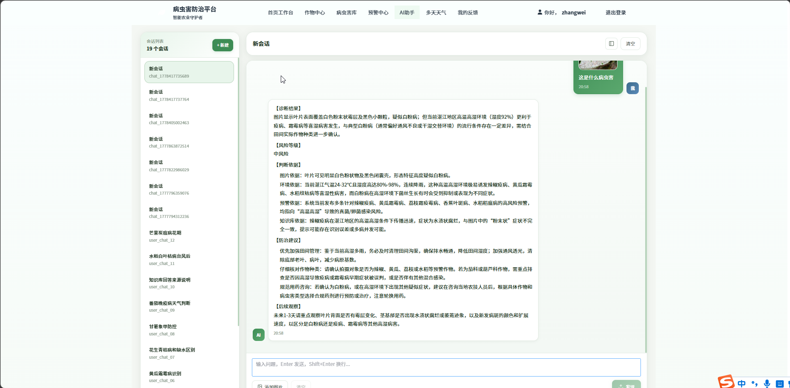
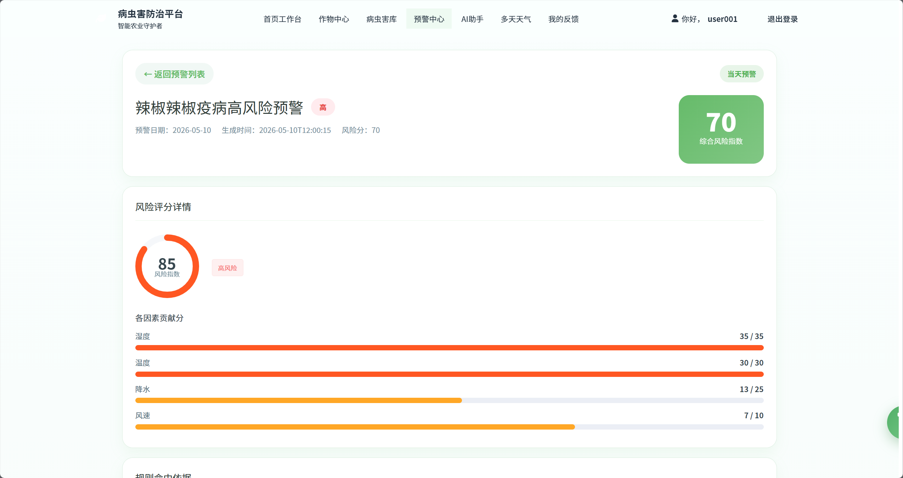
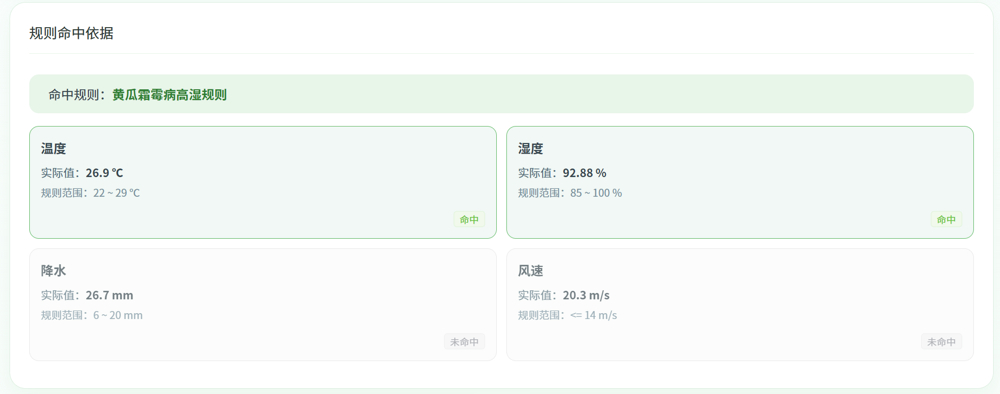
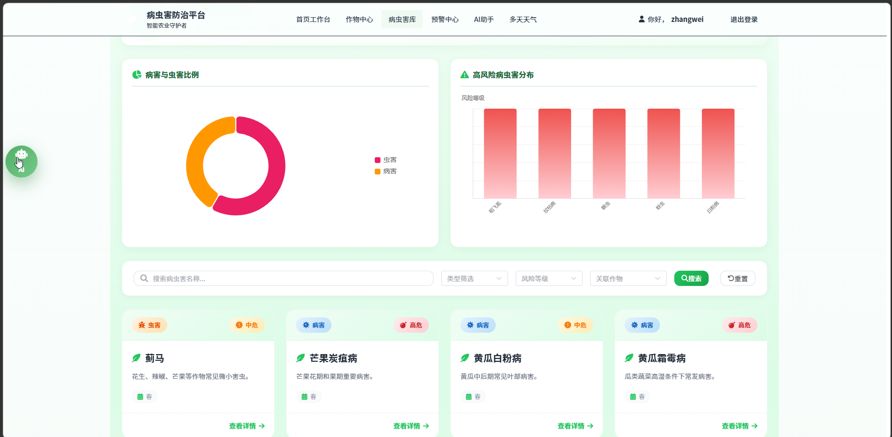
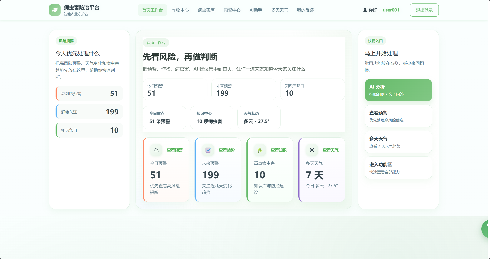
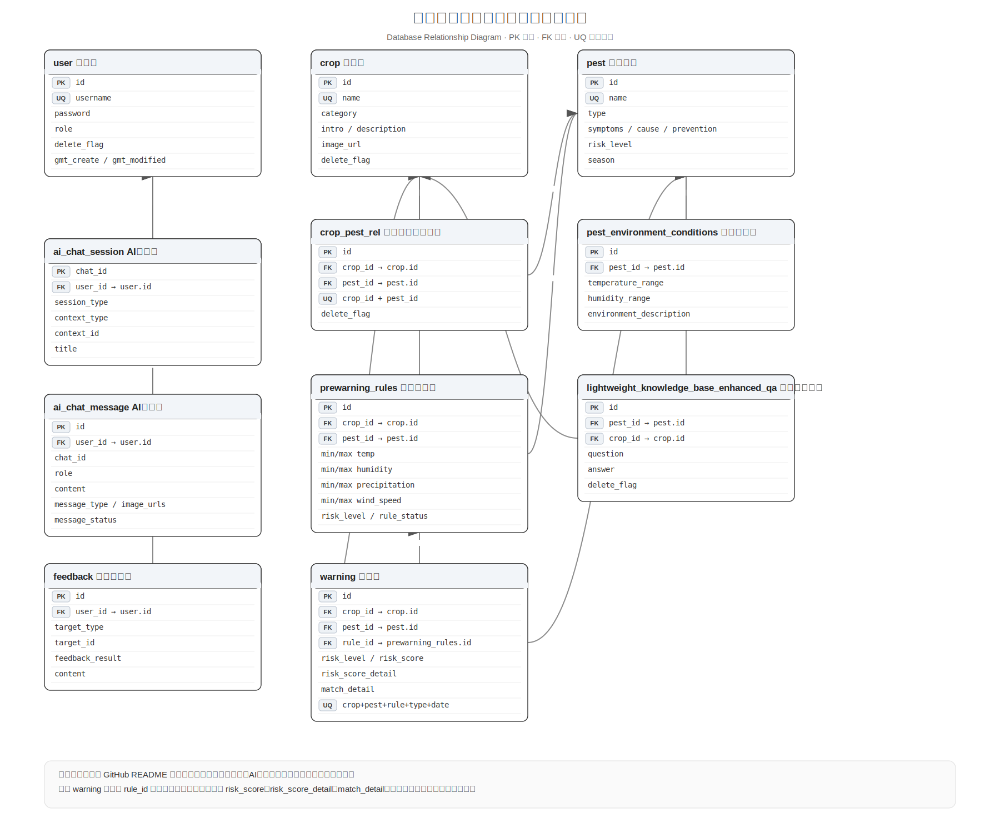

# 农业病虫害智能预警辅助决策系统

> 基于 Spring Boot + Spring AI + RAG 的智慧农业病虫害智能预警平台

融合气象分析、农业规则引擎、风险评分模型、RAG知识库与大模型能力，实现病虫害智能预警、农业知识问答、AI图文分析及辅助决策。

🏆 **国家级大学生创新创业训练计划项目**

---

# 🔥 技术亮点

## 风险评分模型

基于温度、湿度、降水量、风速等环境因子构建风险评分体系，实现病虫害风险量化评估与自动预警。

* 支持多气象因子综合分析
* 支持风险等级划分
* 支持风险贡献度分析
* 风险评分结果可视化展示

---

## 可解释型预警

设计 `match_detail` 命中依据机制，记录规则匹配过程与风险贡献度，实现预警结果可追溯。

支持展示：

* 命中规则
* 命中条件
* 风险贡献明细
* 预警触发原因

帮助用户理解：

> 为什么触发预警？
>
> 哪些因素导致风险升高？

---

## RAG农业知识库

基于 Spring AI + 向量检索构建农业知识库，实现农业知识增强问答。

整体流程：

```text
用户问题
    ↓
向量化
    ↓
TopK知识召回
    ↓
Prompt拼接
    ↓
DeepSeek推理生成
    ↓
返回结果
```

提高农业问答准确性，降低大模型幻觉问题。

---

## AI图文协同分析

结合：

* 病虫害图片
* 当前天气
* 未来天气
* 风险预警信息
* 农业知识库内容

进行综合分析与智能诊断。

相比传统图片识别系统，更加注重 AI 能力与农业业务场景融合。

---

## SSE流式响应

采用 Server-Sent Events（SSE）实现 AI 分析结果实时推送。

支持：

* AI问答流式输出
* AI图文分析流式输出
* 风险报告实时生成

提升用户交互体验。

---

# 📸 项目截图

## AI图文分析



---

## 风险评分分析



---

## 命中依据展示



---

## 数据统计看板



---

## 系统首页



---

# 🚀 技术栈

## 后端

* Java 17
* Spring Boot 3.x
* MyBatis-Plus
* MySQL 8
* Redis
* Maven

## AI能力

* Spring AI
* DeepSeek
* RAG
* SSE

---

# ⚙️ 核心模块设计

## warning（预警模块）

负责病虫害预警生成与风险分析。

核心能力：

* TODAY实时预警
* FORECAST未来预警
* 风险评分计算
* 命中依据生成
* 预警查询与统计

---

## ai（AI能力模块）

负责农业场景下的AI问答与图文分析。

核心能力：

* 农业知识问答
* AI图文分析
* 多轮上下文对话
* SSE流式响应
* 风险解释生成

---

## knowledgeqa（RAG知识库模块）

负责农业知识存储与知识增强检索。

核心能力：

* 农业知识维护
* 向量检索
* TopK知识召回
* RAG增强问答

---

## stats（数据分析模块）

负责预警数据统计与可视化分析。

核心能力：

* 风险等级统计
* 作物预警统计
* 高风险病虫害排行
* 季节趋势分析

---

# 🗄 数据库设计



---

# 📂 项目结构

```text
agriwarningplatform
├── common
│   ├── config
│   ├── constant
│   ├── enums
│   ├── exception
│   ├── handler
│   ├── interceptor
│   └── util
│
├── module
│   ├── ai
│   ├── auth
│   ├── crop
│   ├── feedback
│   ├── knowledgeqa
│   ├── pest
│   ├── pestenvironment
│   ├── prewarningrule
│   ├── stats
│   ├── warning
│   └── weather
│
└── AgriWarningPlatformApplication
```

---

# ⚡ 快速启动

## 环境要求

* JDK 17+
* MySQL 8+
* Redis 7+
* Maven 3.9+

### 1. 创建数据库

```sql
CREATE DATABASE agri_pest_platform;
```

### 2. 执行数据库初始化脚本

导入项目提供的 SQL 文件。

### 3. 修改配置文件

配置：

* MySQL
* Redis
* AI模型接口

### 4. 启动 Redis

```bash
redis-server
```

### 5. 启动项目

```bash
mvn spring-boot:run
```
